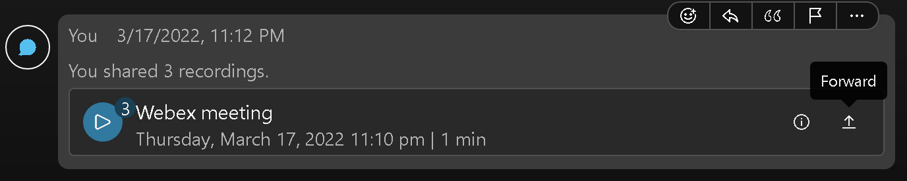
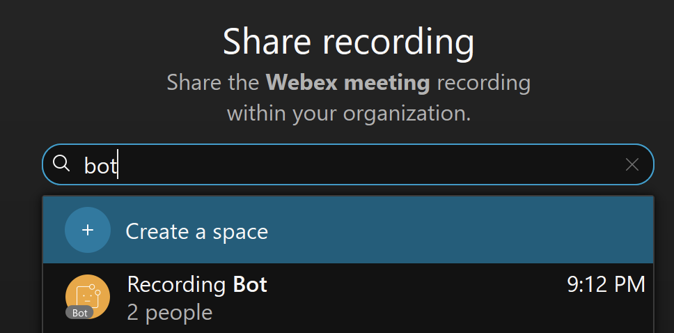
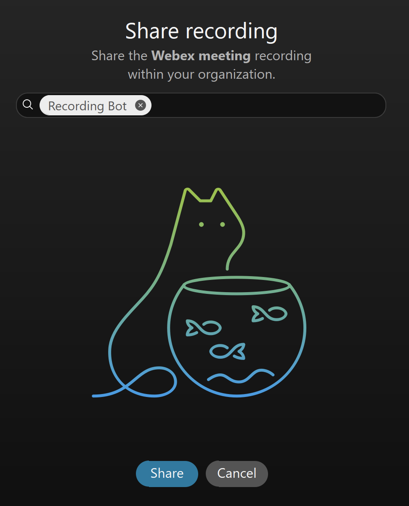
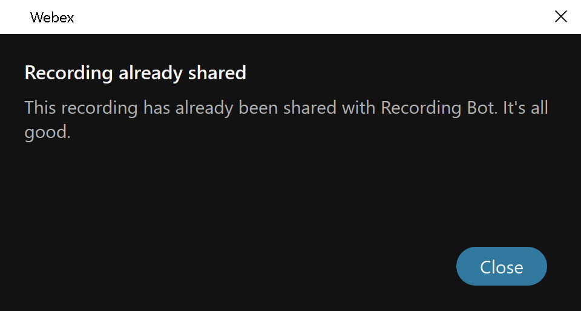

# Webex Recording Download Bot

Webex meeting recordings are normally available for download only to meeting hosts and only using a web browser. Host needs to access the webex site's web page and find the recordings there. This Bot provides a capability to download recordings from a Webex meeting (both Classic and Space meetings) by just sending it a meeting number and host email or by forwarding it a Space recording message.
  
The links for download are temporary links (valid for 4 hours) provided by Webex [Meetings](https://developer.webex.com/docs/api/v1/meetings) and [Recordings](https://developer.webex.com/docs/api/v1/recordings) APIs. The Bot neither downloads the recordings nor it stores any meeting or recording information.

## How It Works
The user can ask the Bot in 1-1 communication for the recordings in following ways:
1. Forward a Space meeting recording from a Space communication to the Bot
2. Send `help` message to the Bot and in the received form fill in the meeting number and optionally host email
3. Send `rec <meeting_num> <host_email>` message to the Bot, host email is optional
Host email is required in the above communication if the meeting is unlisted (private) or the requestor was not the host of the meeting. Additionally the recording requests can be limited by following [config/config.json](./config/config.json) parameters:
- **respond_only_to_host** - Bot provides the recording only to the requestor who was the host of the meeting
- **protect_pmr** - if the recording was created in a PMR, the Bot provides the recording only to the PMR owner. So even if the requestor provides the correct host email, the request is refused unless the requestor is the PMR owner.
- **approved_users** - only users from the list can communicate with the Bot
- **approved_domains** - only users whose email addresses domains are in the domain list can communicate with the Bot

In order to get access to all recordings across the Webex Org, the Bot is using a [Webex Integration](https://developer.webex.com/docs/integrations) in the backend. The integration needs to be authorized by Webex admin and it uses following scopes to access the recording and user information:  
`meeting:admin_schedule_read`  
`meeting:admin_recordings_read`  
`meeting:admin_preferences_read`  
`spark:people_read`  

### 1. Space Meeting Forwarding
Space meeting recording is sent to a Space as a special kind of message which provides integrated playback client.  
  
The recording can be forwarded by clicking on a **Forward** icon.  
  
The user can fill in the list of recipients or create a Space.  
  
Each recipient can receive the meeting only once. If you want to repeat the forwarding to the same recipient, you need to first delete the forwarded recording from your 1-1 communication with the recipient and then try forwarding it again.  
  

### 2. Using a Form
As a response to `help` message, the Bot sends a [Buttons & Cards](https://developer.webex.com/docs/buttons-and-cards) form in which the requestor can fill in the meeting number and optionally host email.  
  

### 3. Sending a `rec` Message
A 1-1 message to the Bot in the format `rec <meeting_num> <host_email>` provides the recording.  
  

## How to Install
The Bot written in Python is provided for [Docker Compose](https://docs.docker.com/compose/)
