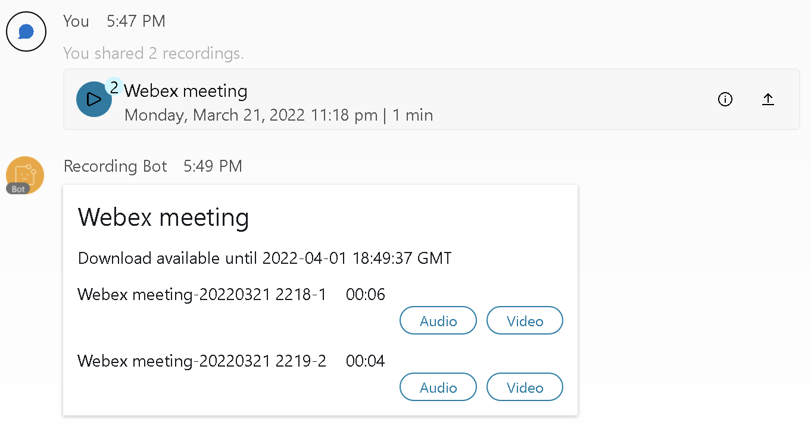
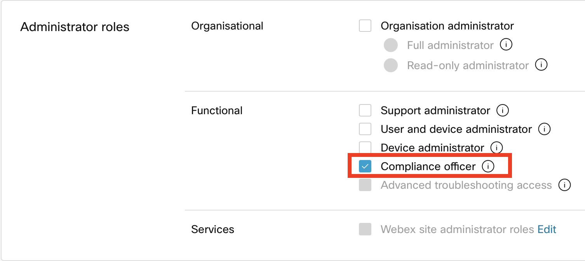
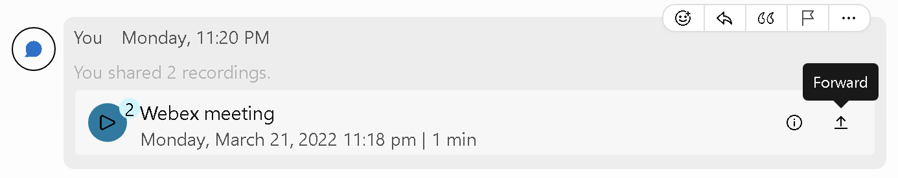
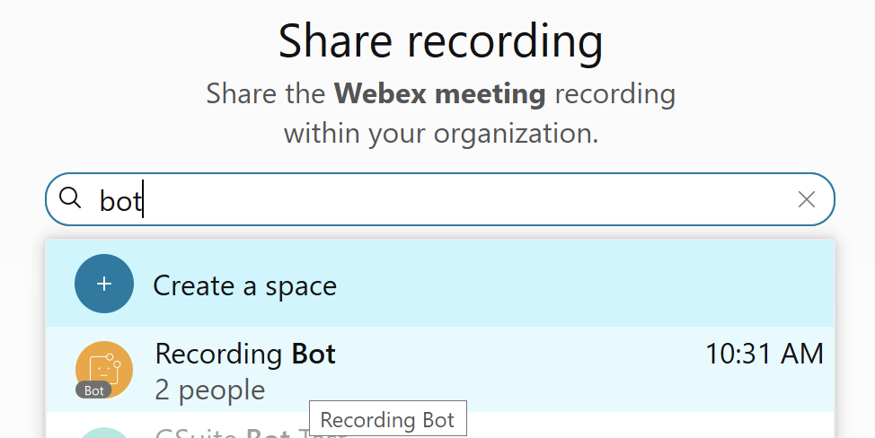
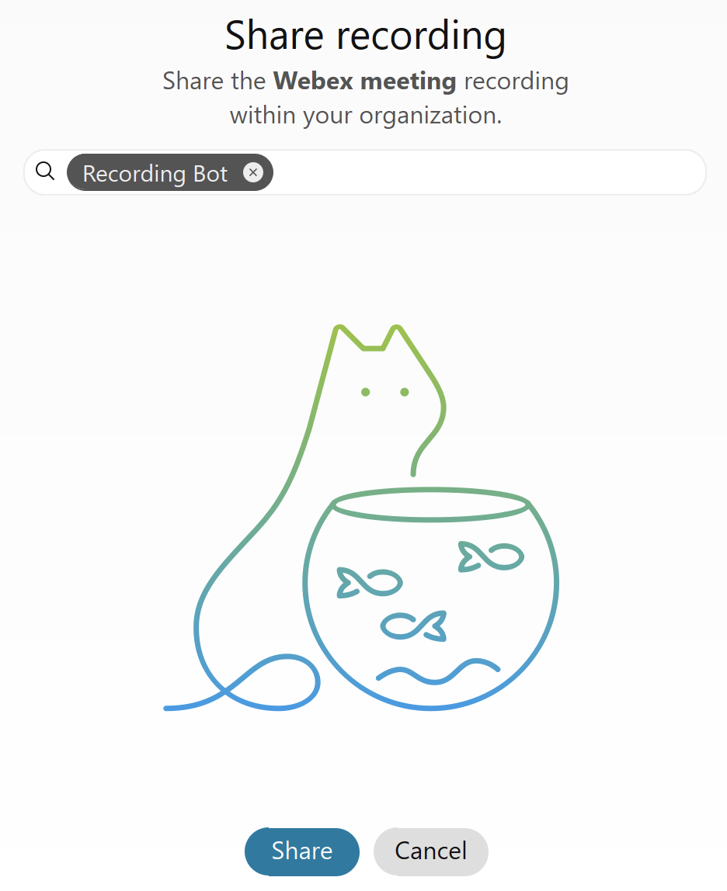
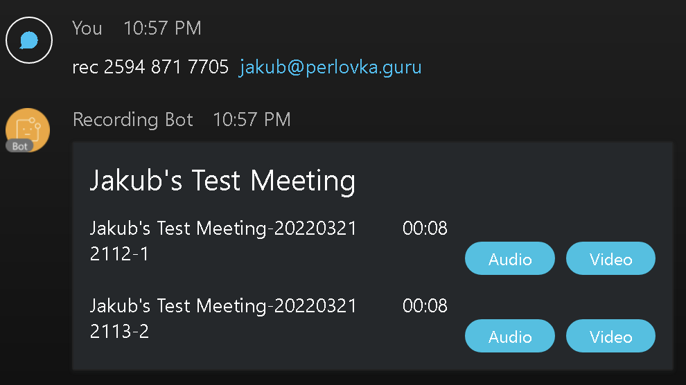
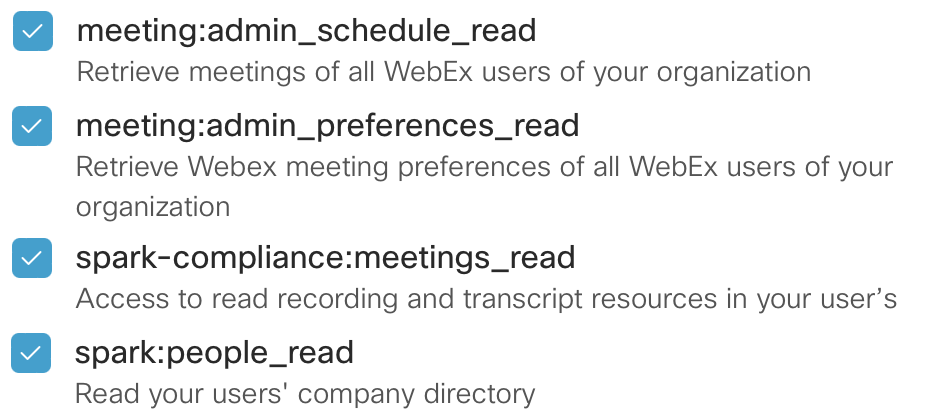
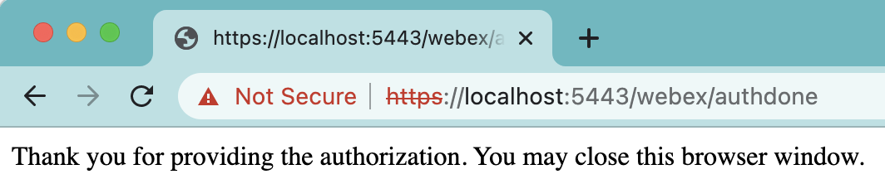
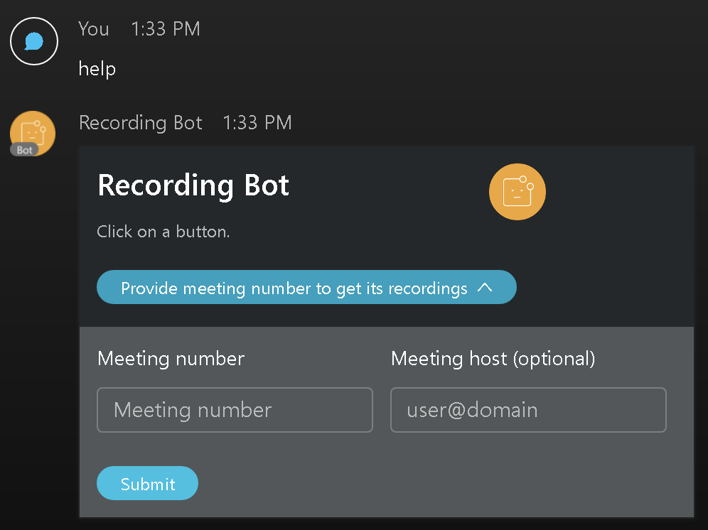

# Webex Recording Download Bot

Webex meeting recordings are normally available for download only to meeting hosts and only using a web browser. Host needs to access the webex site's web page and find the recordings there. This Bot provides a capability to download recordings of a Webex meeting (both Classic and Space meetings) by just sending it a meeting number and host email or by forwarding it a Space recording message.
  
The links for download are temporary links (valid for 4 hours) provided by Webex [Meetings](https://developer.webex.com/docs/api/v1/meetings) and [Recordings](https://developer.webex.com/docs/api/v1/recordings) APIs. The Bot neither downloads the recordings nor it stores any meeting or recording information.

## How It Works
The user can ask the Bot in 1-1 communication for the recordings in following ways:
1. Forward a Space meeting recording from a Space communication to the Bot
2. Send `help` message to the Bot and in the received form fill in the meeting number and optionally host email
3. Send `rec <meeting_num> <host_email> <days_back>` message to the Bot. `host_email` is optional. `days_back` specifies how many days back from now is searched for the same meeting number (default is 10 days).  

> If a meeting number is used (options 2 and 3), only the meeting recordings from `days_back` range are provided. This is done to simplify the Bot workflow.  
Host email is required in the above communication, if the requestor was not the host of the meeting, the meeting is unlisted (private) or if `days_back` parameter is used.  
Additionally the recording requests can be limited by following [config/config.json](./config/config.json) parameters:
> - **respond_only_to_host** - Bot provides the recording only to the requestor who was the host of the meeting
> - **protect_pmr** - if the recording was created in a PMR, the Bot provides the recording only to the PMR owner. So even if the requestor provides the correct host email (and the respond_only_to_host is set to **false**), the request is refused unless the requestor is the PMR owner.
> - **approved_users** - only users from the list can communicate with the Bot
> - **approved_domains** - only users whose email addresses domains are in the domain list can communicate with the Bot

In order to access all recordings across the Webex Org, the Bot is using a [Webex Integration](https://developer.webex.com/docs/integrations) in the backend. **The integration needs to be authorized by a Compliance officer**, i.e. the user who has **Compliance Officer** functional role.  
  
The integration uses following scopes to access the recording and user information:  
`meeting:admin_schedule_read`  
`meeting:admin_preferences_read`  
`spark-compliance:meetings_read`  
`spark:people_read`  
The Bot works as a user front-end. The Bot uses either websockets or [webhooks](https://developer.webex.com/docs/webhooks) for its communication. Websocket implementation is based on [Webex Bot](https://pypi.org/project/webex-bot/) by [Finbarr Brady](mailto:finbarr.brady@gmail.com). Webhook is implemented using [Flask](https://flask.palletsprojects.com/en/2.2.x/).  
The advantage of websockets is that there is no need for or any special firewall setup and publicly accessible URLs. From the network perspective the Bot works as a Webex App. The Webex API calls are performed via standard HTTPS using [Webex Teams SDK](https://webexteamssdk.readthedocs.io/en/latest/index.html).  
Webhook on the other hand provides higher scalability and flexibility of execution environment. Webhook can be hosted at
various cloud services as a docker image or a server-less function.

### 1. Space Meeting Forwarding
Space meeting recording is sent to a Space as a special kind of message which provides an integrated playback client.  
  
The recording can be forwarded by clicking on a **Forward** icon.  
  
The user can fill in the list of recipients or create a Space.  
  
Each recipient can receive the recording only once. If you want to repeat the forwarding to the same recipient (for example when testing the Bot), you need to first delete the forwarded recording from your 1-1 communication with the recipient and then try forwarding it again.  
  

### 2. Using a Form
As a response to `help` message, the Bot sends a [Buttons & Cards](https://developer.webex.com/docs/buttons-and-cards) form in which the requestor can fill in the meeting number and optionally host email and number of days back to search for the meeting.  
  

### 3. Sending a `rec` Message
A 1-1 message to the Bot in the format `rec <meeting_num> <host_email> <days_back>` provides the recording. If `host_email` is omitted, requestor's email is used. Default `days_back` is 10.  
  

---
## How to Install
The Bot is written in Python and can be run:
1. as a Docker image (webhook or websocket mode) - [Docker Compose](https://docs.docker.com/compose/) example provided
2. as a server-less function (webhook mode) - Amazon Lambda or Azure Function to name a few
3. locally in a Python virtual environment (websocket mode; webhook only if public URL can be provided, e.g. via some port forwarding like NGROK or SSH)

## 1. Running as Docker image
Following steps are needed to get it running as Docker image. The Docker image can be either built locally (follow all steps in this section) or used from Docker Hub. Docker Hub approach is easier mainly due to an simpler update process.

### Docker Hub image
To use the Docker Hub image, follow the configuration steps 1 - 4, but first copy `docker-compose-dockerhub.yml` to `docker-compose.yml`. After configuration is complete, run  
`docker-compose up` with optional `-d` parameter.

### 1. Download from Github
a) Create a folder where the application will be stored, run  
`git clone https://github.com/JardaMartan/meeting-recording.git`.  
b) Open **docker-compose.yml** in a text editor.

### 2. Create a Bot
a) Login to https://developer.webex.com  
b) Click on the user's icon in the top right corner and select **My Webex Apps**  
c) Create a **Bot**. Note that Bot's e-mail address has to be unique across all Webex users, so include some org-specific info like `adams.recording.bot@webex.bot`.  
d) Copy **Bot Access Token** and paste it to the **docker-compose.yml** to the **BOT_ACCESS_TOKEN** variable (replace `paste_your_bot_access_token` with it).

### 3. Create an Integration
a) In **My Webex Apps** create an **Integration**  
b) The important part of the Integration setup is a **Redirect URI**. It is used in OAuth Grant Flow process to receive an authorization code from Webex. If you know a hostname of your Docker server, enter it as a part of the URL, otherwise set it to **https://localhost:5443/webex/redirect**. The Redirect URI can be changed or another one added later.  
c) Select (check) the scopes:  
`meeting:admin_schedule_read`  
`meeting:admin_preferences_read`  
`spark-compliance:meetings_read`  
`spark:people_read`  
  
d) Click **Add Integration**  
e) Copy **Client ID** , **Client Secret** and **Integration ID** and paste them to the **WEBEX_INTEGRATION_CLIENT_ID**, **WEBEX_INTEGRATION_CLIENT_SECRET** and **WEBEX_INTEGRATION_ID** variables in **docker-compose.yml**  
f) Save **docker-compose.yml**

### 4. Edit the `config/config.json`
a) set the **approved_users** and/or **approved_domains**. Bot will only respond to the users who match the lists.  
b) set the **respond_only_to_host** and **protect_pmr** parameters. If **respond_only_to_host** is set to `true`, the Bot provides meeting recordings only to the meeting host. If **protect_pmr** is set to `true`, the Bot provides PMR recordings only to the PMR owner even if the **respond_only_to_host** is set to `false`.

> If the `config.json` is changed while the Bot is running, the change is detected automatically. Restart is not needed.

### 5. Don't Forget to Commit the Configuration Changes
After changing **docker-compose.yml**, **config.json** or any part of the Bot code, run  
`git commit -a -m "config update"`  
This will reduce conflicts when doing a Bot code update from Github using `git pull`.

### 6. Build the Docker Image
a) Run `docker-compose build` command on the Docker host command line.

### 7. Start the Application
a) Run `docker-compose up` command on the Docker host command line. If you want to run the app permanently, run `docker-compose up -d`.

### 8. Authorize the Application
a) In a web browser open the authorization URL, for example: `https://localhost:5443/webex/authorize`  
b) Webex login page will load. Enter **Compliance Officer's email address** and password. If your Webex organization does not have a Compliance officer account yet, you need to create one. For security reasons, do not assign Compliance officer role to an ordinary user.  
c) Confirm the requested Integration scopes.  
d) If all goes well, you will end up on a confirmation page:  
  

### 9. Try 1-1 Communication With the Bot
a) Send 1-1 message to the Bot with the text `help`  
b) If the sender matches the **approved_users** or **approved_domains** from [config/config.json](./config/config.json), the Bot responds with the form for entering a meeting number and host email.  
  
c) Try getting some recording.

### 10. Update the Bot Code
This is a work in progress, in order to keep up with the code changes following command sequence is needed:  
a) Update the Bot code:  
`git pull`  
Enter and save commit message or resolve conflicts if asked.  
b) Shutdown the Bot:  
`docker-compose down`  
c) Rebuild the Bot:  
`docker-compose build`  
d) Run the Bot:  
`docker-compose up -d`  

Docker Hub image gets updated using `pull` command, so this sequence is needed:  
`docker-compose down`  
`docker-compose pull`  
`docker-compose up -d`  

## 3. Running locally

### 1. Create virtual environment

### 2. Run 
